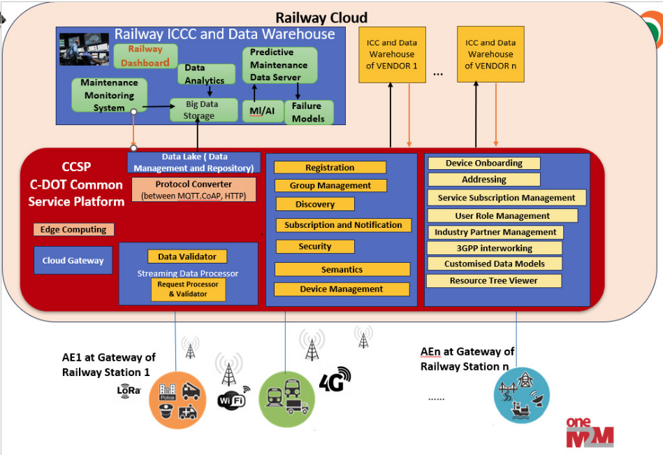

# Architecture with CCSP

This section provides an overview of the integration and high-level architecture of RDPMS with CCSP (Common Control & Service Platform).

## Overview

The architecture of RDPMS is designed to seamlessly integrate with CCSP for efficient monitoring, diagnostics, and predictive maintenance of assets. The platform ensures reliable data communication between various components, enabling real-time insights and control.

## Key Components of the Architecture

1. **Station Gateway**:
   - Acts as the primary communication interface between local assets and the CCSP platform.
   - Responsible for collecting diagnostic data, performing local processing, and forwarding necessary information to the cloud.

2. **Cloud AE (Application Entity)**:
   - Hosts the central application logic for data aggregation, analytics, and decision-making.
   - Facilitates real-time notifications and predictive analytics.

3. **CCSP Platform**:
   - Provides the middleware for managing data storage, subscriptions, and notifications.
   - Ensures secure and standardized communication between Station Gateway and Cloud AE.

## High-Level Data Flow

1. **Data Collection**:
   - The Station Gateway collects data from assets and sensors.
   - Data is formatted into standardized payloads for transmission.

2. **Data Transmission**:
   - Standard MQTT topics are used to publish data from the Station Gateway to CCSP.
   - CCSP stores the data and triggers notifications as needed.

3. **Cloud Integration**:
   - The Cloud AE subscribes to relevant CCSP topics.
   - It processes the data for diagnostics, maintenance alerts, and predictive analytics.

## Benefits of Integration with CCSP

- **Standardized Communication**: Ensures uniform data exchange using oneM2M-compliant protocols.
- **Real-Time Insights**: Enables real-time monitoring and diagnostics of assets.
- **Scalability**: Supports the integration of multiple gateways and assets.
- **Predictive Maintenance**: Leverages data analytics for proactive maintenance and reduced downtime.