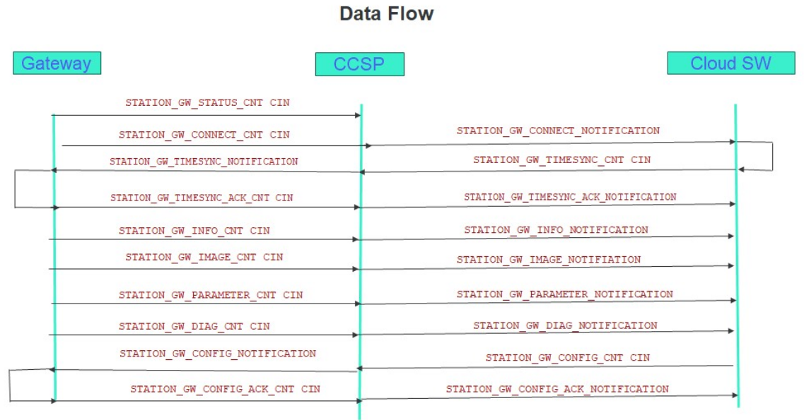

# Welcome to RDPMS Guide

This section provides useful details about the RDPMS project and its messages.

## About RDPMS

```
RDPMS stands for "Remote Diagnostics and Predictive Maintenance Solutions."
RDPMS is an application platform designed to monitor, analyze, and optimize the performance of assets in remote locations. 
The platform focuses on providing real-time diagnostics, maintenance alerts, and predictive analytics.
It enhance the reliability and efficiency of equipment, helping to prevent costly downtime and extend asset life.
```

<p>For more details, please visit the <a href="https://docs.google.com/document/d/1cE9JMSqpLdfA3ZbQ7_uuH78NSWcDUhBA/edit?usp=sharing&ouid=118122802747448962476&rtpof=true&sd=true" target="_blank">RDPMS Standard Data Format</a> Document.</p>


## RDPMS Message Communication Flow



