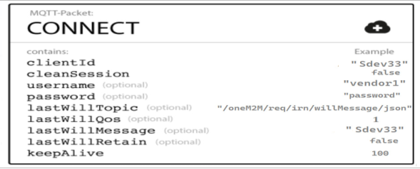

# Station Gateway Overview

## Introduction
The **Station Gateway** is an embedded electronic unit deployed at each station to facilitate data acquisition, processing, and communication with the **RDPMS Application Software** hosted on the **Railway Cloud** via the **CCSP Layer**.

## Key Functions
- Receives data from **sensors** and **diagnostic ports** of station equipment.
- Converts and transmits data using **oneM2M Standard Data Format** and **MQTT Protocol**.
- Ensures **interoperability** across different vendor systems through standardized communication.
- Provides **event logging** to store up to **5 million events** or a **minimum of 10 days** of data.
- Supports **secure data transmission** and **remote access capabilities**.

## Communication & Security
- Converts data into **oneM2M format** before transmitting it to the **CCSP Layer**.
- Supports various transmission media, including **OFC, Ethernet, wireless networks, and voice channels**.
- Includes **12 configurable serial ports** for communication with station equipment.
- Implements **data security measures** to prevent unauthorized access.
- Complies with **TEC IoT Security Guidelines** and undergoes periodic cybersecurity audits.

## Prerequisites 
Before setting up a Station Gateway, certain components must already be in place to ensure seamless integration with the CCSP platform and other railway management systems. The following prerequisites must be met:
```yaml
- Cloud AE of vendor has already registered and is up and running.
- RAILWAY_MGMT_AE has already registered and is up and running.
- Railway-cloud-endpoint is pre-shared with OEMs.
```

### Configuration File
- This file will be shared with the gateway vendor once the configuration of the station gateway is done at CCSP.
- For details, refer to **Device Configuration Parameters**.
- This configuration file will be mailed to the vendor.
- It will be loaded by the OEM on their respective gateway.

### MQTT Packet and MQTT Topics for Station Gateway

#### MQTT Packet:
- `<Client-Id>` (as a simple string)  
  → ClientID will be set to the following format:  
    - `<AE-ID>`
- **Sample Connect Packet**


#### Publish Topic:
```yaml
/oneM2M/reg_req/<Gateway-AE-ID>/<CSE-ID>/json
/oneM2M/req/<Gateway-AE-ID>/<CSE-ID>/json
```
#### Topic to be Subscribed:
```yaml
/oneM2M/reg_resp/<Gateway-AE-ID>/<CSE-ID>/json
/oneM2M/resp/<Gateway-AE-ID>/<CSE-ID>/json
/oneM2M/req/<CSE-ID>/<Gateway-AE-ID>/json
```

### One-Time Resources to be Created by Station Gateway
???+ tip "Resources"
    ```yamal
    - Station Gateway AE Registration Request
    - Station Gateway Connect Container and Subscription
    - Station Gateway Information Container and Subscription
    - Station Gateway Parameter Container and Subscription
    - Station Gateway Image Container and Subscription
    - Station Gateway Diagnostics Container and Subscription
    - Station Gateway Time Sync Container and Subscription
    - Station Gateway Configuration Container and Subscription
    - Station Gateway Time Sync Acknowledgement Container and Subscription
    - Station Gateway Configuration Acknowledgement Container and Subscription
    ```

## Conclusion

???+ example "Quick Summary"
    This **Station Gateway** serves as the critical interface between station-level data sources and the **CCSP Layer**, ensuring efficient, standardized, and secure data communication within the **RDPMS ecosystem**.

