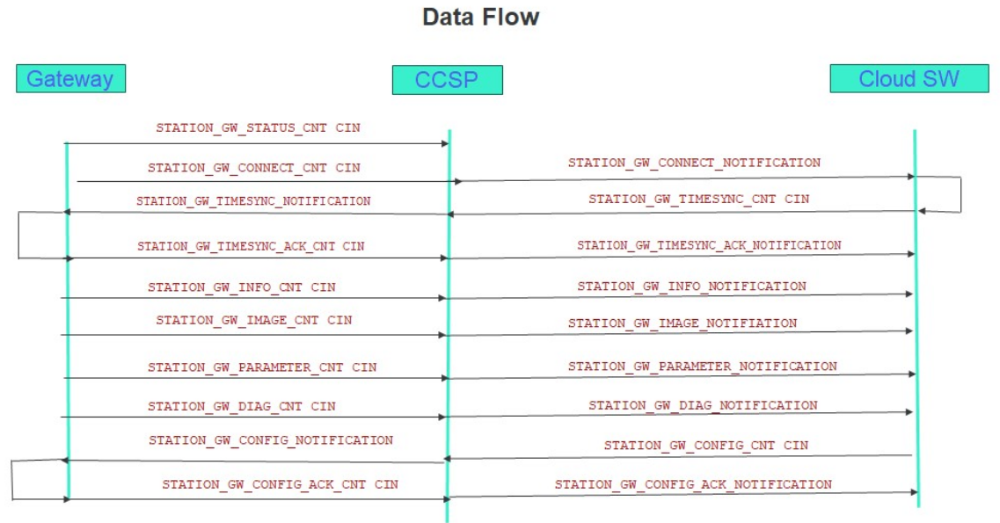

# Station Gateway Hierarchy

## Overview

- The Station Gateway Hierarchy defines how station gateways **interact with the CCSP** (C-DoT's Common Service Platform) and the railway management system. 
- Each station gateway maintains **structured containers** that store and manage different types of data, such as connection status, diagnostic reports, sensor values, and configuration updates. 

- The RDPMS Message Communication Flow illustrates how **messages are exchanged** between the **station gateway, CCSP, and cloud applications,** ensuring real-time monitoring and control.

## Types of Containers in Standard Data Format

???+ abstract "Container Types"
    - ### <u>**Station Gateway Connect Container**</u>: 
    Created by the station gateway on the CCSP Layer, subscribed by the cloud app. It notifies the application software when a station gateway connects, reboots, or recovers from a power failure.

    - ### <u>**Station Gateway Information Container**</u>: 
    Created by the station gateway on the CCSP Layer, subscribed by the cloud app. It sends installation details and updates when sensors/IoT devices are added or removed. This occurs at least once a month and should be configurable.

    - ### <u>**Image Container**</u>: 
    Created by the station gateway, subscribed by the cloud app. It provides a snapshot of all parameter values at a defined interval (default: 24 hours, configurable).

    - ### <u>**Parameter Container**</u>: 
    Created by the station gateway, subscribed by the cloud app. It sends data when: a parameter changes by ±2% in the last 5 seconds or specific parameters (e.g., voltage/current of certain equipment) are sampled every 20 ms over 5 seconds or a packet is sent every 5 seconds with these values.

    - ### <u>**Diagnostic Container**</u>: 
    Created by the station gateway, subscribed by the cloud app. It reports the health status of all sensors/IoT devices when a fault occurs or at a configurable interval (default: 12 hours).

    - ### <u>**Time Sync Container**</u>: 
    Created and subscribed by the station gateway. The application software writes to it, sending a time synchronization request to the station gateway at first connection or at a configurable interval (default: 24 hours).

    - ### <u>**Time Sync Acknowledgment Container**</u>: 
    Created by the station gateway, subscribed by the cloud app. It sends an acknowledgment after the time sync process is completed.

    - ### <u>**Configuration Container**</u>: 
    Created and subscribed by the station gateway. The application software writes configuration updates, which are then received by the station gateway.

    - ### <u>**Configuration Acknowledgment Container**</u>: 
    Created by the station gateway, subscribed by the cloud app. It sends an acknowledgment once a configuration update is processed.

    - ### <u>**Station Gateway Status Container**</u>: 
    Created by the CCSP Layer. The station gateway sends an initial content instance to inform CCSP that all containers have been created, allowing access control policies to be activated.

## RDPMS Message Communication Flow

???+ tip "Message Flow Diagram"
    

## Next Steps
- The station Gateway shall create its resource hierarchy with ACP-ID shared in its configuration file.
This will provide the station gateway with the privileges -CRUDN for `<AE>`, `<container>`, and
`<subscription>` resources only in its station gateway `<AE>` resource.
- Once resource hierarchy is created by Station Gateway AE, it shall create <ContentInstance>
resource in status container of RAILWAY_MGMT_AE resource to indicate that it has created its
hierarchy.
- RAILWAY_MGMT_AE will be notified and it will set the privileges such that station gateway AE
will be able to send data now.